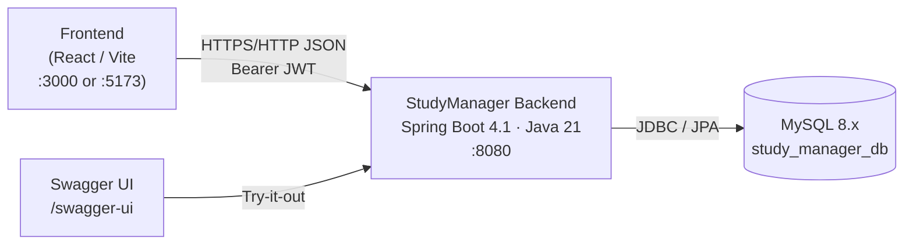
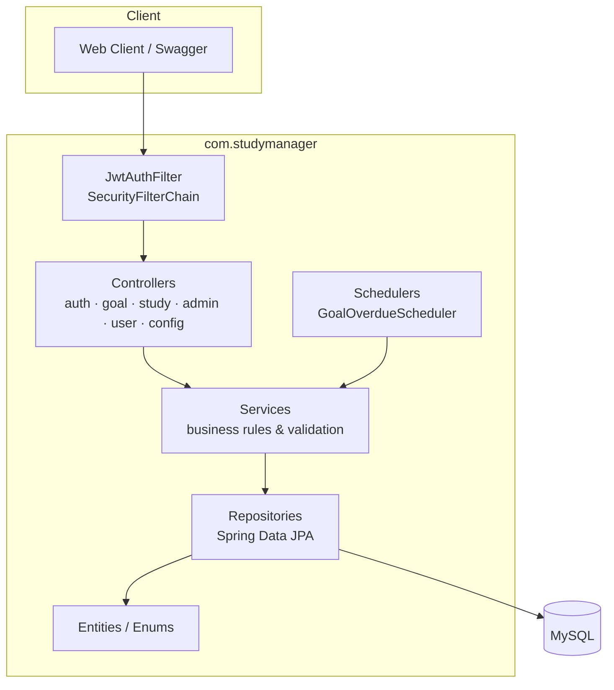
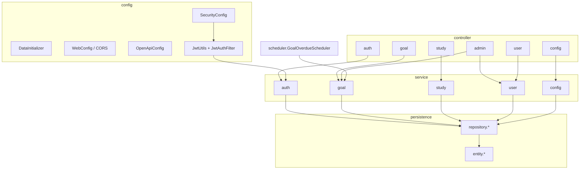
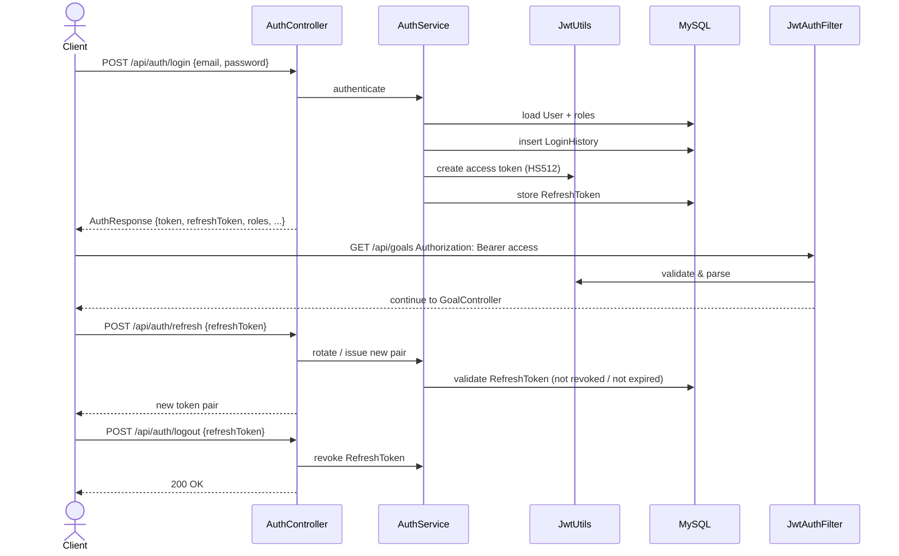
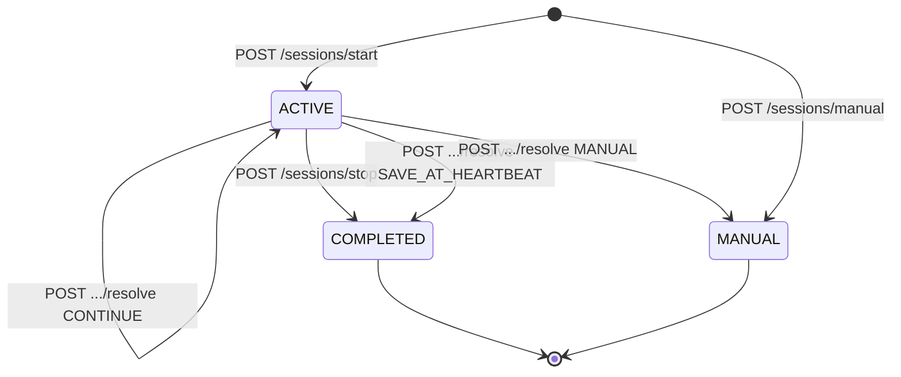
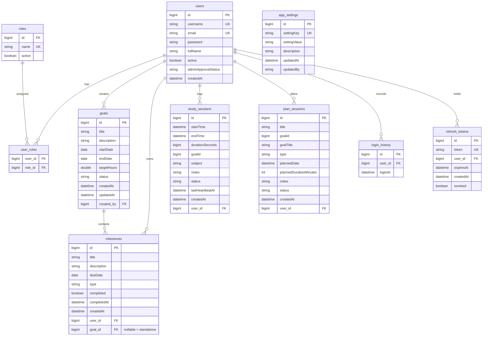
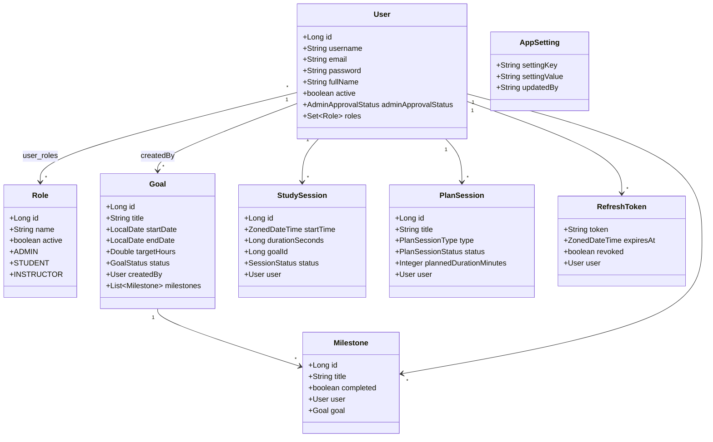
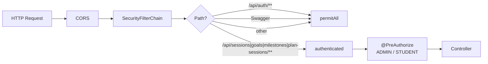

# StudyManager Backend — Architecture & UML

> Visual overview of the Spring Boot REST API: layered components, auth flow, domain model, and package layout.

**Docs:** [English](README.md) · [Türkçe](README_TR.md) · [Deutsch](README-DE.md)

Diagrams use [Mermaid](https://mermaid.js.org/) (renders on GitHub / most Markdown viewers).

---

## Table of Contents

1. [System context](#1-system-context)
2. [Layered architecture](#2-layered-architecture)
3. [Package / component view](#3-package--component-view)
4. [Authentication sequence](#4-authentication-sequence)
5. [Study session lifecycle](#5-study-session-lifecycle)
6. [Entity-relationship (ER)](#6-entity-relationship-er)
7. [Class overview (domain)](#7-class-overview-domain)
8. [Security & roles](#8-security--roles)
9. [Scheduled jobs](#9-scheduled-jobs)

---

## 1. System context



---

## 2. Layered architecture



**Request path:** HTTP → CORS / Security → JWT filter → Controller → Service → Repository → MySQL → DTO response.

---

## 3. Package / component view



| Package | Responsibility |
|---|---|
| `config` / `config.security` | Security, JWT, CORS, OpenAPI, seed data |
| `controller.*` | REST endpoints, auth annotations |
| `service.*` | Domain logic, ownership checks, limits |
| `repository.*` | Spring Data JPA interfaces |
| `entity.*` | JPA entities & enums |
| `dto.request` / `dto.response` | API contracts |
| `scheduler` | Cron jobs (overdue goals) |

---

## 4. Authentication sequence



**Token lifetimes** (defaults): access `86400000` ms (24h), refresh `604800000` ms (7d). Refresh lifetime is absolute from login (does not extend on refresh).

---

## 5. Study session lifecycle



Duration is capped by `app_settings.max.session.hours` (default 6, clamp 6–24).

---

## 6. Entity-relationship (ER)



**Notes:**

- `study_sessions.goalId` and `plan_sessions.goalId` are logical references (columns), not JPA `@ManyToOne` FKs.
- Milestones may be goal-linked (`goal_id` set) or standalone (`goal_id` null, `user_id` set).

---

## 7. Class overview (domain)



### Enums

| Enum | Values |
|---|---|
| `GoalStatus` | `ACTIVE`, `PAUSED`, `OVERDUE`, `COMPLETED`, `CANCELLED`, `ARCHIVED` |
| `SessionStatus` | `ACTIVE`, `COMPLETED`, `MANUAL` |
| `PlanSessionType` | `STUDY`, `REVIEW`, `EXAM_PREP`, `PROJECT` |
| `PlanSessionStatus` | `PLANNED`, `COMPLETED`, `MISSED` |
| `AdminApprovalStatus` | `NONE`, `PENDING`, `APPROVED`, `REJECTED` (as used by registration flow) |

---

## 8. Security & roles



| Area | Access |
|---|---|
| `/api/auth/**` | Public |
| Swagger / OpenAPI | Public |
| `/api/sessions/**`, `/api/goals/**`, `/api/milestones/**` | Authenticated (JWT) |
| `/api/plan-sessions/**` | Authenticated + `@PreAuthorize("hasAuthority('STUDENT')")` |
| Admin approvals, login-history, admin settings | `@PreAuthorize("hasAuthority('ADMIN')")` |

Passwords are hashed with **BCrypt**. JWT algorithm: **HS512**.

---

## 9. Scheduled jobs

```mermaid
sequenceDiagram
  participant Cron as GoalOverdueScheduler
  participant Svc as GoalOverdueService
  participant DB as goals table

  Note over Cron: cron = app.goals.overdue-cron<br/>default 0 0 1 * * * (01:00 daily)
  Cron->>Svc: syncOverdueGoals()
  Svc->>DB: ACTIVE/PAUSED where endDate &lt; today → OVERDUE
  Svc-->>Cron: updated count
```

---

## Related configuration

| Setting | Location |
|---|---|
| Datasource, JWT, overdue cron | `src/main/resources/application.properties` |
| CORS origins | `SecurityConfig` + `WebConfig` → `localhost:3000`, `localhost:5173` |
| Seed users & `max.session.hours` | `DataInitializer` |

---

*StudyManager · architecture reference · Spring Boot 4.1.0 · Java 21 · MySQL*
